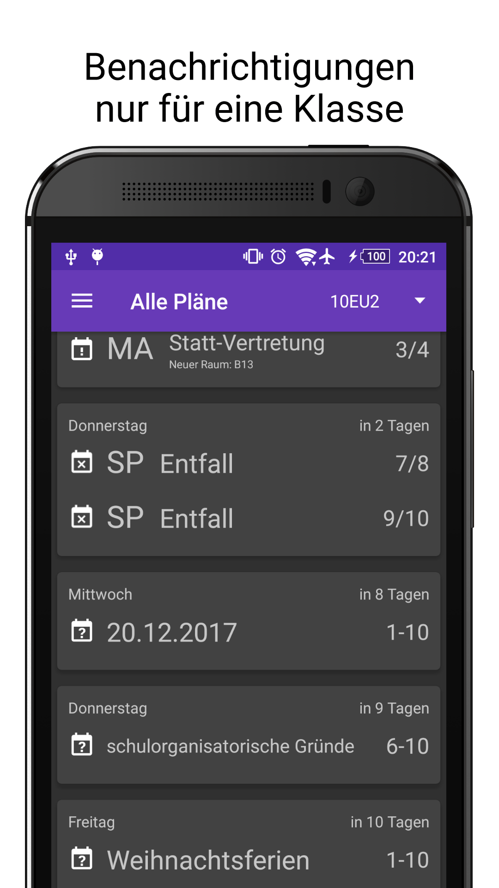
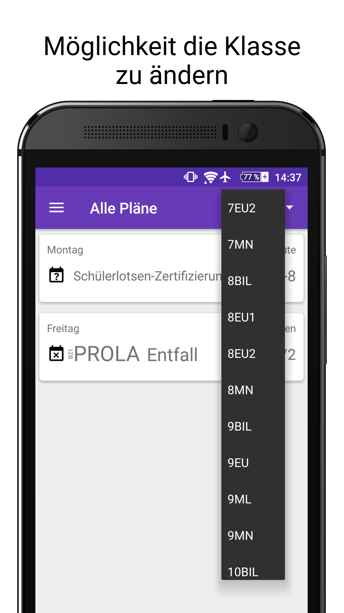
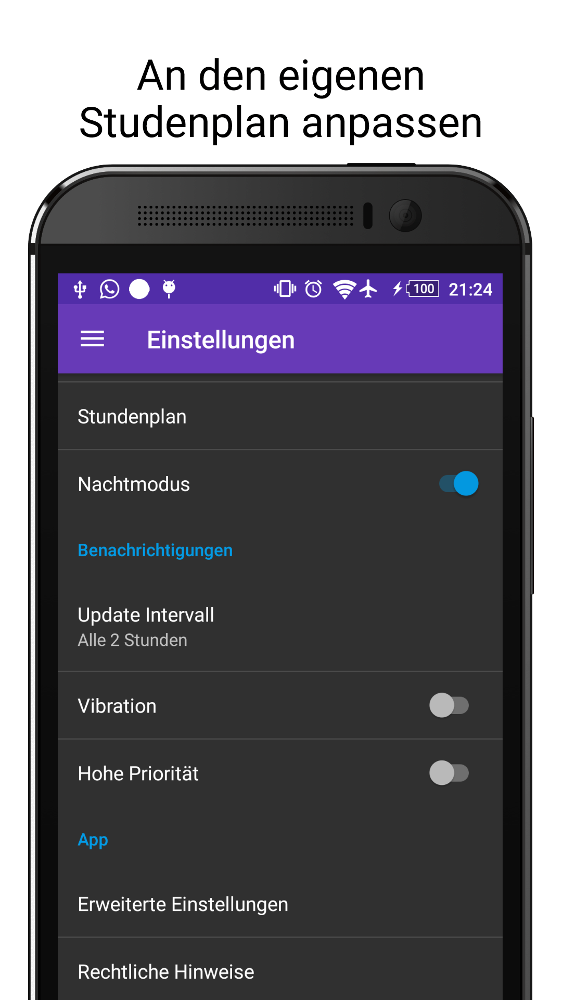

# SchoolScheduleApp
This is obsolete source code from my substitution schedule app I created during my free time in high school.

The code is not refactored throughout and does not follow clean code standards. 

Since the school's website and permissions have changed, the app probably won't be able to download data from the substitution schedule.
However, for other WebUntis based substitution plans, it is possible to enter a custom URL in the app under the Config tab.
The prerequisite for this is that the URL and thus the data is public.

# Screenshots from ±2018
  
